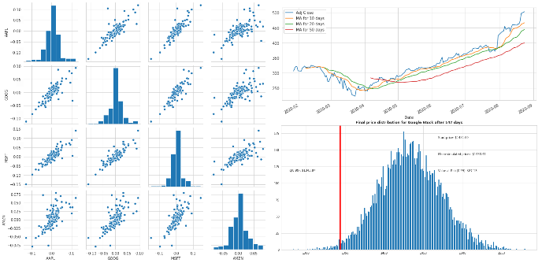

## Portfolio

---

### NLP

Turkish Sentiment Analysis
[Github](https://github.com/Gdkmak/Turkish-Sentiment-Analysis/)

This project shows a comparison between three different approaches to train and test sentiment classification model to identify people’s opinions in Turkish language and label them as positive or negative, based on the emotions people’s express within them. Two Machine Learning techniques are namely Logistic Regression and Naive Bayes. Then Neural Networks using Embedding and 1D convolutional layers. Finally, the state-of-the-art pretrained BERT model is used to yield the best results. the following figures are yield from testing the models.

   |Naive Bayer|Logistic Rregression|Deep Learning|BERT
---|----|----|----|-----
No preprocessing|87%|88%|88%|95% 
With preprocessing|82%|82%|83%|88%

---

[Chatbot](https://github.com/Gdkmak/BERT-chatbot)

---

### Analytics 

- [Stock_Market_Analysis_For_Google_and_Apple](https://github.com/Gdkmak/analytics/blob/master/Stock_Market_Analysis_For_Google_and_Apple.ipynb/)
  
  
  

  
- [EDA_Data_Science_Jobs](https://github.com/Gdkmak/analytics/blob/master/EDA_Data_Science_Jobs.ipynb/)
  
  
  
  
  
- [Hypothesis_Testing_And_Predictive_Analysis](https://github.com/Gdkmak/analytics/blob/master/Hypothesis_Testing_And_Predictive_Analysis.ipynb/)

---

### Time Serise

[Cryprocurruncy and Social Media](https://github.com/Gdkmak/CryptoCurrenciesSocialMedia)

---

### Computer Vision

[Human_activity_correctness](https://github.com/Gdkmak/Human_activity_correctness)

---

