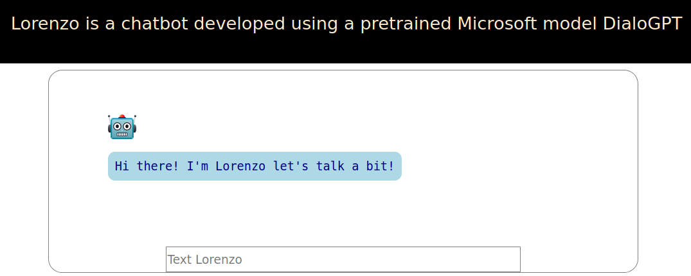
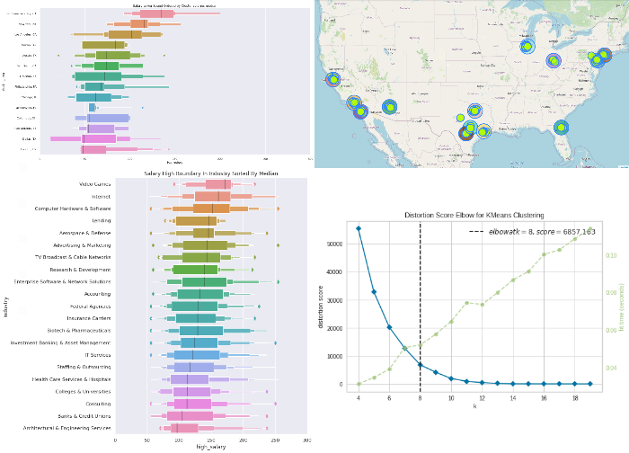

# Portfolio:

---

## NLP:

***Turkish Sentiment Analysis***
[GitHub](https://github.com/Gdkmak/Turkish-Sentiment-Analysis/)

This project shows a comparison between three different approaches to train and test sentiment classification model to identify people’s opinions in Turkish language and label them as positive or negative, based on the emotions people’s express within them. Two Machine Learning techniques are namely Logistic Regression and Naive Bayes. Then Neural Networks using Embedding and 1D convolutional layers. Finally, the state-of-the-art pretrained BERT model is used to yield the best results. the following figures are yield from testing the models. 

Preprocessing|Naive Bayer|Logistic Rregression|Deep Learning|BERT
---|----|----|----|-----
No |87%|88%|88%|95%
Yes|82%|82%|83%|88%

Technologies used: TensorFlow, Keras, sklearn, Transformer, Torch, Flask   

---

***ChatBot Lorenzo*** 

[GitHub](https://github.com/Gdkmak/BERT-chatbot)

Lorenzo is a chatbot built using the awesomeness of Transformers library and Microsoft’s Large-scale Pretrained Response Generation Model (DialoGPT). Try to talk to Lorenzo he is still learning.

---

## Analytics: 

***Stock Market Analysis For Apple, Google, Microsoft and Amazon***
[GitHub](https://github.com/Gdkmak/analytics/blob/master/Stock_Market_Analysis_For_Google_and_Apple.ipynb/)

Stock market for the big four technology stocks, Apple, Microsoft, Amazon, and Google. Main goal here to visualise and take a deep look at different way to analyse the risk of stocks considering their history changes.
  

  
***EDA Data Science Jobs***
[Google Colab](https://colab.research.google.com/github/Gdkmak/analytics/blob/master/EDA_Data_Science_Jobs.ipynb)
  
In this anlysis explore Data Science Jobs during pandamic, and try to explore some hidden detailes in mutiple industries and for different job describtions. The dataset was created by picklesueat and contains more than 3900 job listing for data scientist positions scraped from glassdoor and other sites.

  
***Hypothesis Testing And Predictive Analysis***
[GitHub](https://github.com/Gdkmak/analytics/blob/master/Hypothesis_Testing_And_Predictive_Analysis.ipynb/)

The data is taken from lacity.org website. It has payroll information for all Los Angeles City Employees including the City's three proprietary departments: Water and Power, Airports and Harbor. Two types of hypothesis testing is applied to check if there is a difference in the payroll between two years 2015 and 2016. In addition, predictive analysis is implemented using Random Forest and Linear Regression. 

---

## Computer Vision

***Human_activity_correctness***
[GitHub](https://github.com/Gdkmak/Human_activity_correctness)

# Evaluating Pre-processing Methods with Deep Learning Algorithms on Human Activity Skelton Data Obtained from Kinect and Vicon Sensors

##### The aim, here, is to investigate how to yield optimal results in this field by trying various different approaches at every stage of skeleton data processing; as a consequence of this work, HAR might take a significant step forward. This reposotry tries to tackle the issue of variable sized inputs. 

### Dataset Used

##### In order to achieve this aim, I will be using an open access dataset called [UI-PRMD](https://webpages.uidaho.edu/ui-prmd/). This data was collected by Idaho University using a Vicon optical tracker, and a Kinect camera. The data provides the angles and positions of body joints in relation to patients (subjects) who were undergoing physical therapy and rehabilitation programs which required the undertaking of common exercises such as deep squats, standing shoulder abduction etc.

### Invented approach is based on drawing New Joint coordinates on the Trajectory Based on a Threshold:

This possible approach is to draw new frame(s) between two existing frames by using 3D interpolation. The question here how to draw these frame(s), which consists of joints coordinates x,y and z? The answer here is using the trajectory between two consecutive frames. When an object with mas moves from point A to point B, it follows a path through space. This path is called the trajectory. 

This suggests to locate and draw new joints coordinates on the trajectory if only the difference between two consecutive frames exceeds a certain threshold. The difference will be called gap. The gap is the absolute difference between the summation of all x coordinates in two consecutive frames. i is the number of frame in the gesture and j is the number of coordinates in the same gesture. Please refer to the notation below. 

The average of gaps in each gesture will be taken. The same process will be repeated for all gestures from the same classification in the same movement. This process will result in a scalar. For example, if I have 100 incorrect gestures and 100 correct gestures in movement number 5. After calculating the average of gaps in each gesture, we will end up with a scalar of 100 elements for incorrect gestures and another scalar with 100 elements for correct gesture. The average of each scalar is the threshold of each classification in the movement number 5.  

Now we calculated the gap and the threshold, what are they useful for? Now we go again to the gesture and check if a gap exceeds a threshold, then joints coordinates values will be polynomially interpolated to draw a new frame(s) on a trajectory between two frames.

This figure shows two consecutive frames in elbow flexion gesture. The gap between the frames in the right arm space is relatively big and exceeded the threshold. Therefore, we filled this gap with a body coordinates and hence a frame. 

---

## Time Serise

***Cryprocurruncy and Social Media*** (University project)
[GitHub](https://github.com/Gdkmak/CryptoCurrenciesSocialMedia)

The project aim is to analyse influences of social media, in particular Twitter, on Bitcoin rate, in the current time period (Q1 2019). Therefore, we will apply different machine learning methods and algorithms to identify common trends and make forecasts as accurate as possible.

